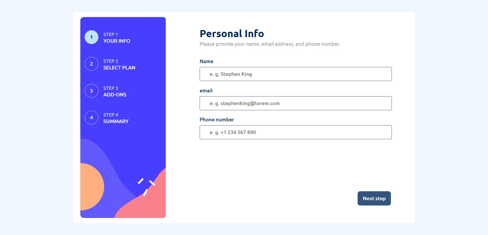
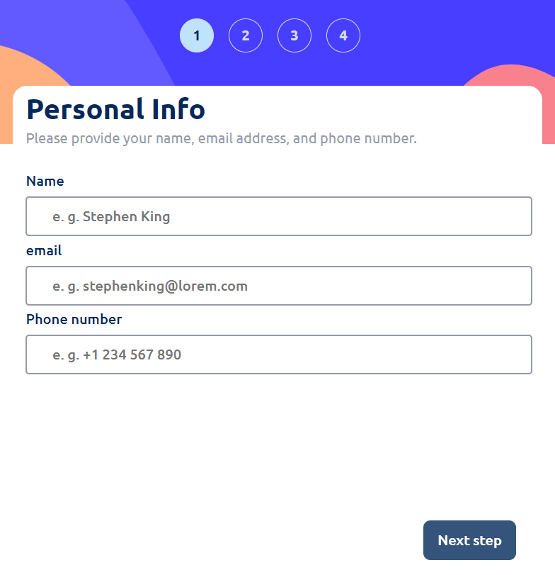
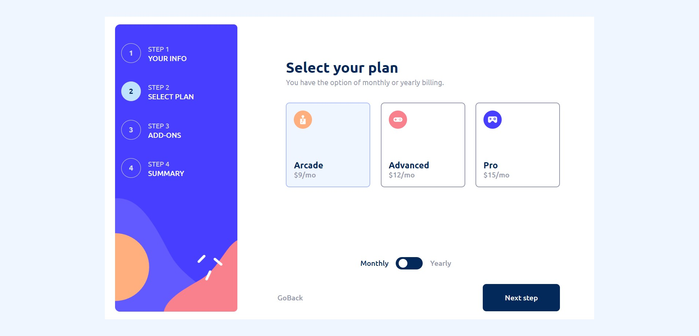
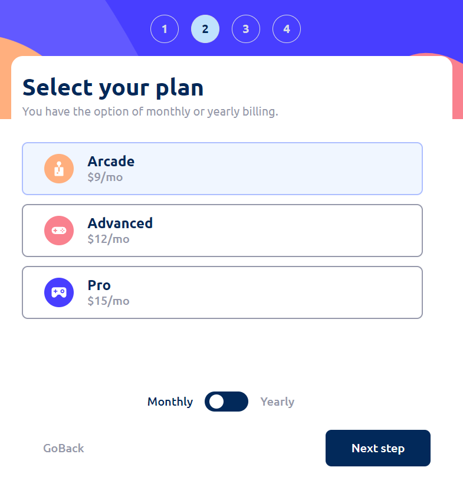
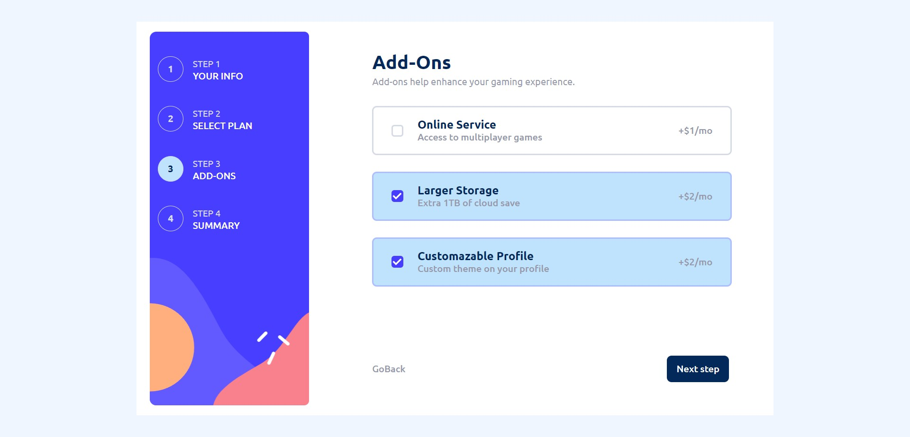
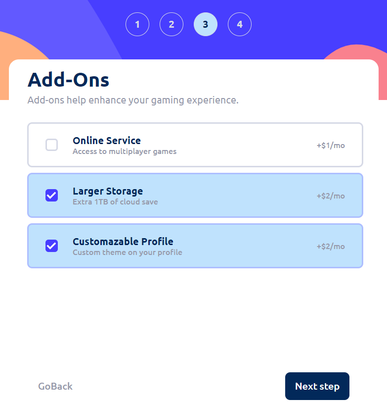
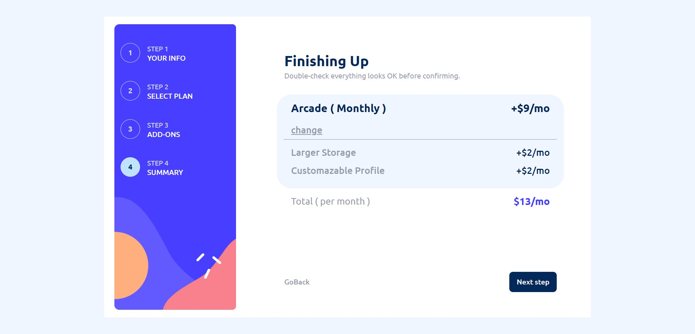
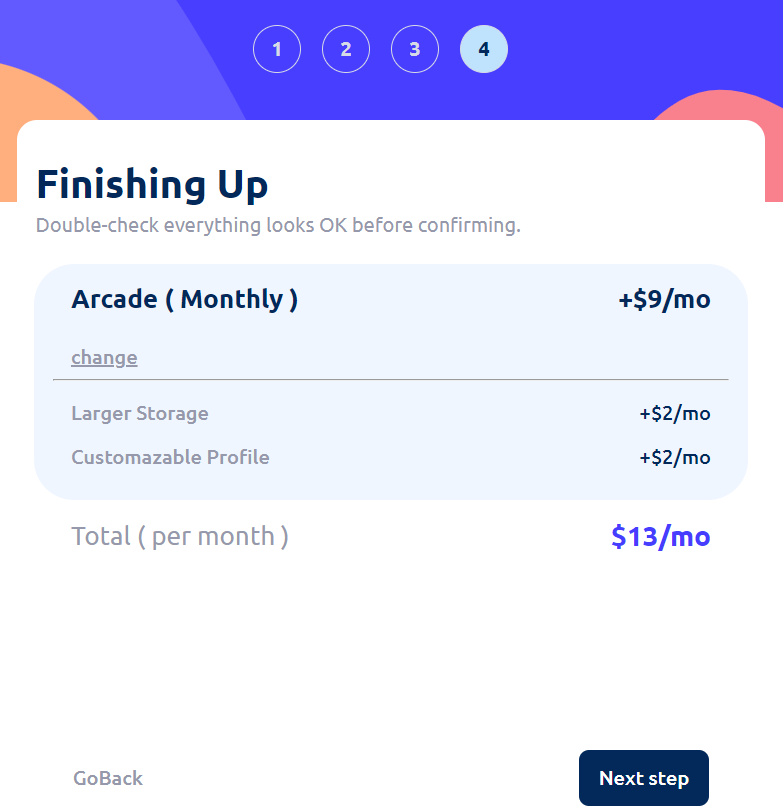
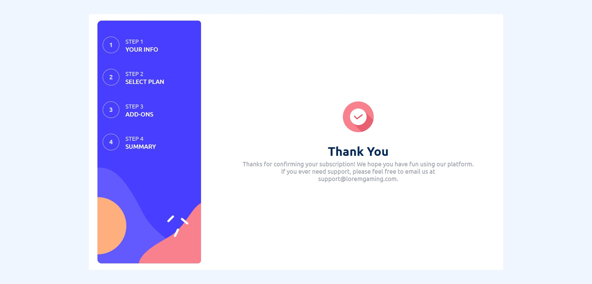

# Frontend Mentor - Multi-step form solution

## Level

</img>

This is a solution to the [Multi-step form challenge on Frontend Mentor](https://www.frontendmentor.io/challenges/multistep-form-YVAnSdqQBJ). Frontend Mentor challenges help you improve your coding skills by building realistic projects.

## Table of contents

- [Overview](#overview)
  - [Screenshots](#screenshots)
- [My process](#my-process)
  - [Built with](#built-with)
  - [Folder Structure](#folder-structure)
- [Author](#author)
- [Acknowledgments](#acknowledgments)

## Overview

### Screenshots

#### Personal Info

- Desktop

  </img>

- tablet

  </img>

#### Select Your Plan

- Desktop

  </img>

- tablet

  </img>

#### Add-Ons

- Desktop

  </img>

- tablet

  </img>

#### Summary

- Desktop

  </img>

- tablet

  </img>

#### Thank you

- Desktop

  </img>

- tablet

  </img>

## My process

### Built with

- Vite + React
- Javascript
- Semantic HTML
- CSS custom properties
- Flexbox
- Desktop-first workflow

### folder structure

SRC:

- assets
  - images
  - react.svg
- Components
  - Forms
    - Personal Info
      - index.jsx
      - style.module.css
    - Select you Plan
      - index.jsx
      - style.module.css
    - Add-Ons
      - index.jsx
      - style.module.css
    - Summary
      - index.jsx
      - style.module.css
    - Thank you
      - index.jsx
      - style.module.css
  - Track Bar
    - index.jsx
    - style.module.css
- App.css
- App.jsx
- main.jsx

## Author

- GitHub - [This](#author)
- Frontend Mentor - [@AubChar101](https://www.frontendmentor.io/profile/AubChar101)

## Acknowledgments

- [Meee](#author)
