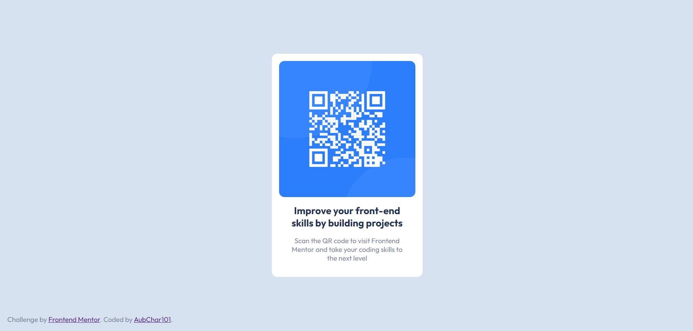

# Frontend Mentor - QR code component solution

## Level

</img>

This is a solution to the [QR code component challenge on Frontend Mentor](https://www.frontendmentor.io/challenges/qr-code-component-iux_sIO_H). Frontend Mentor challenges help you improve your coding skills by building realistic projects.

## Table of contents

- [Overview](#overview)
  - [Screenshot](#screenshot)
- [My process](#my-process)
  - [Built with](#built-with)
- [Author](#author)
- [Acknowledgments](#acknowledgments)

## Overview

### Screenshot

Image Preview:

## My process

### Built with

- Just HTML and CSS
- Semantic HTML5 markup
- CSS custom properties
- Flexbox
- Desktop-first workflow

## Author

- GitHub - [This](#author)
- Frontend Mentor - [@AubChar101](https://www.frontendmentor.io/profile/AubChar101)

## Acknowledgments

[Mee](#author)
