# Frontend Mentor - Space tourism website challenge

## Level

</img>

This is a solution to the [Space tourism website challenge on Frontend Mentor](https://www.frontendmentor.io/challenges/space-tourism-multipage-website-gRWj1URZ3). Frontend Mentor challenges help you improve your coding skills by building realistic projects.

## Table of contents

- [Overview](#overview)
  - [Screenshot](#screenshot)
- [My process](#my-process)
  - [Built with](#built-with)
  - [Folder Structure](#folder-structure)
- [Author](#author)
- [Acknowledgments](#acknowledgments)

## Overview

### Screenshot

#### Home

- Desktop

  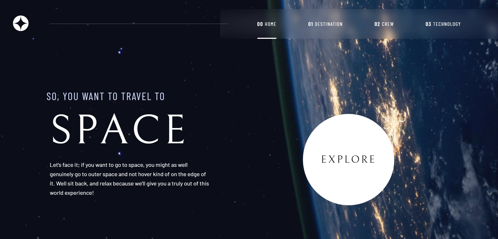</img>

- tablet

  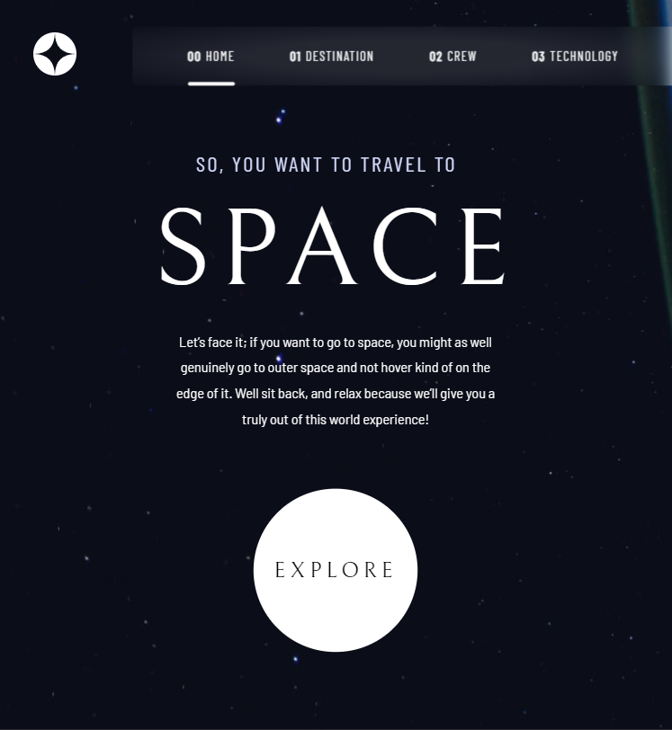</img>

- mobile

  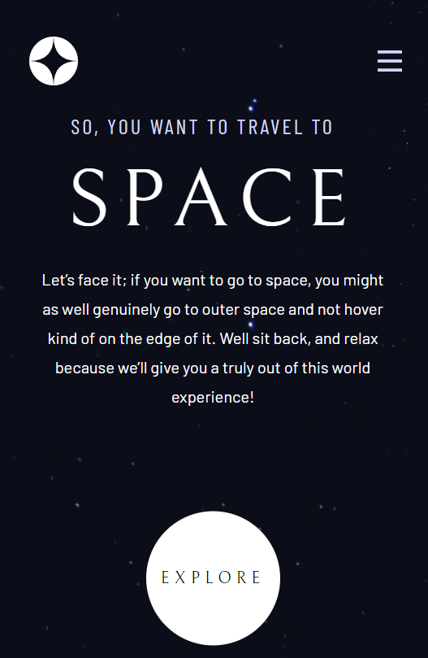</img>

#### destination

- Desktop

  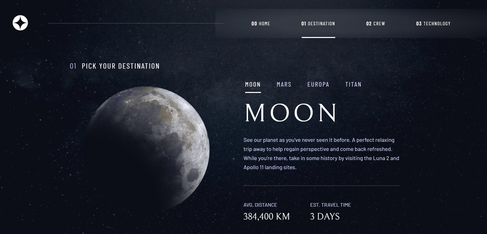</img>

- tablet

  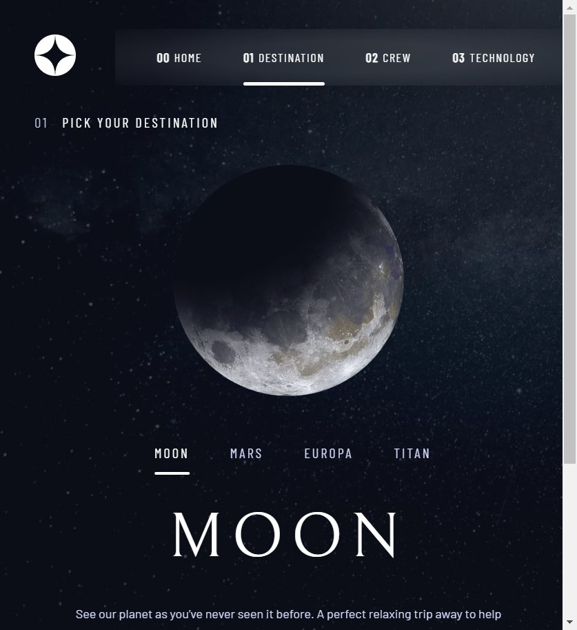</img> 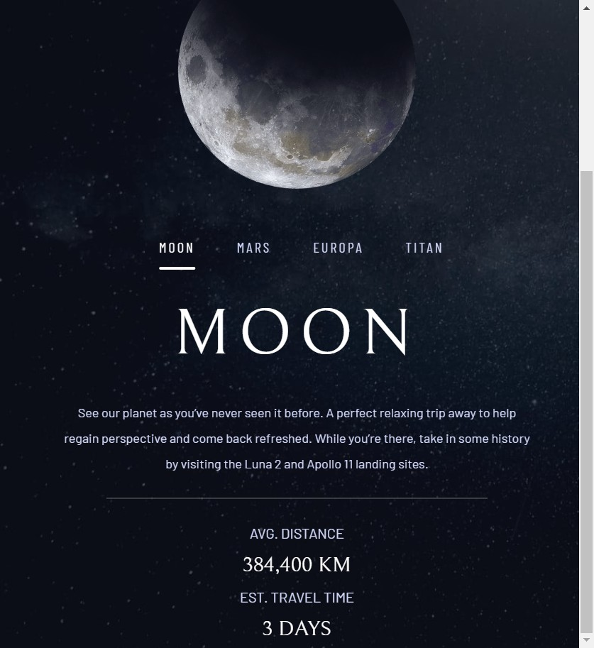</img>

- mobile

  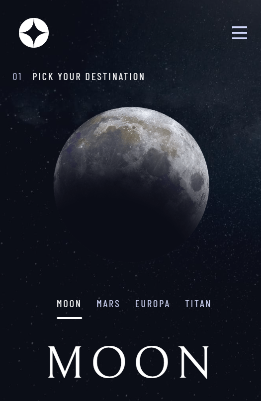</img>

#### crew

- Desktop

  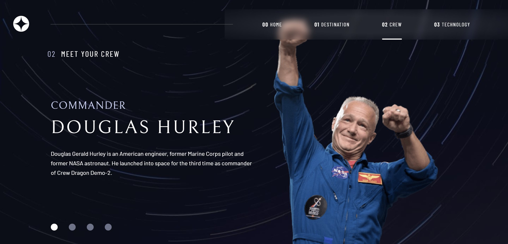</img>

- tablet

  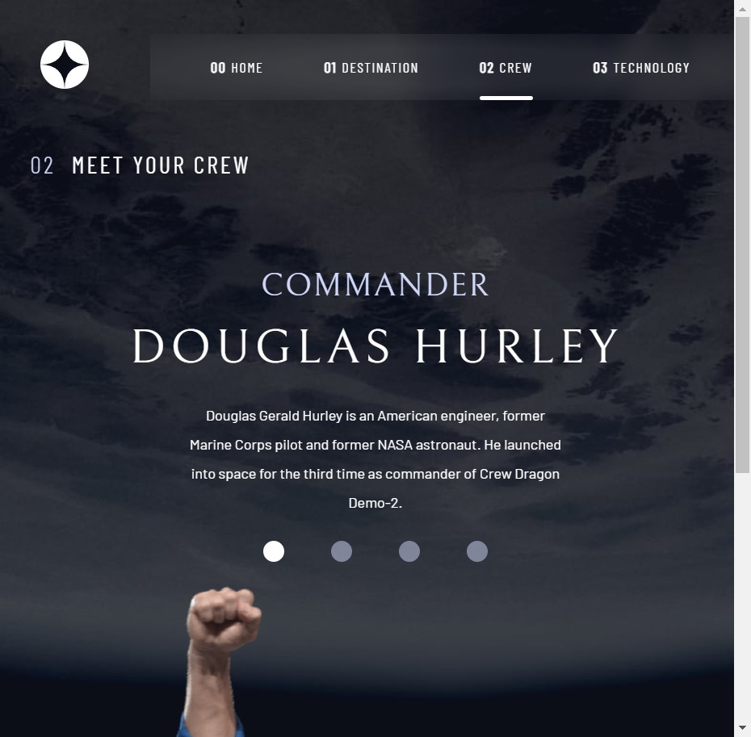</img>

- mobile

  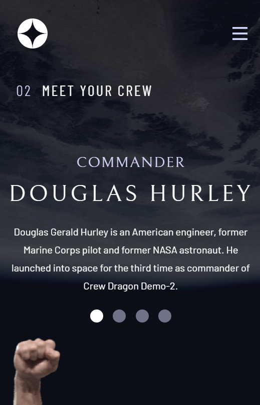</img>

#### technology

- Desktop

  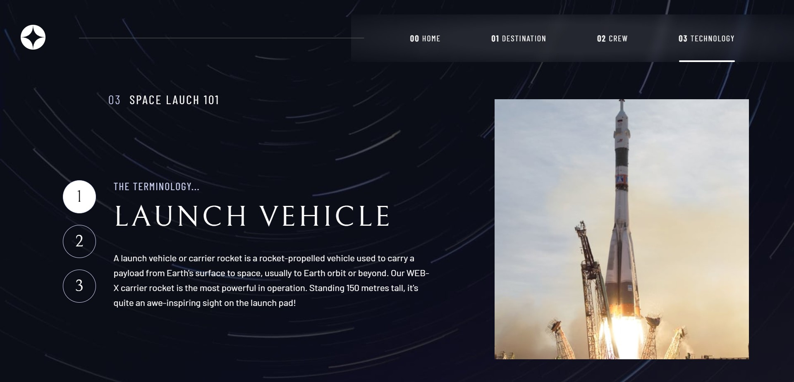</img>

- tablet

  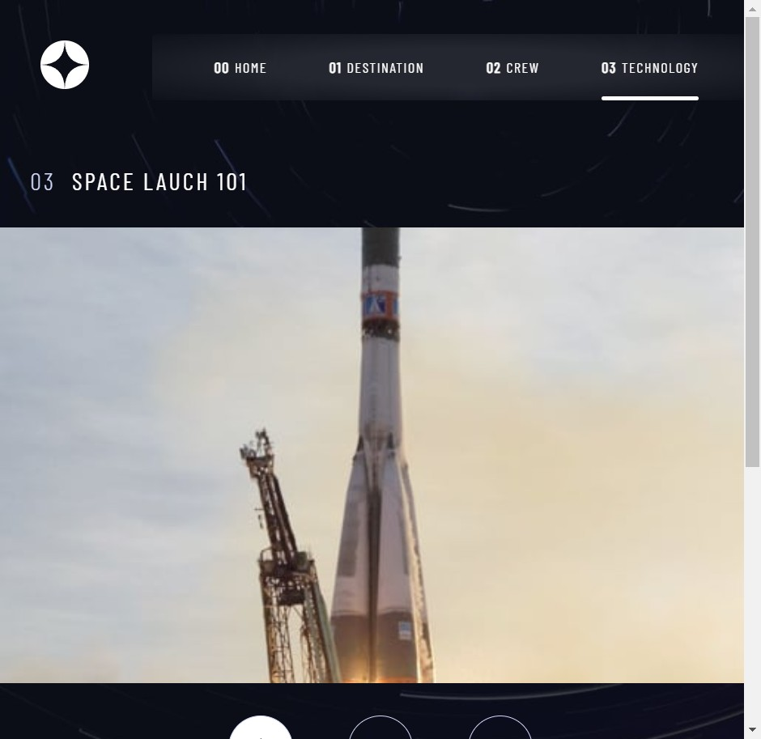</img> 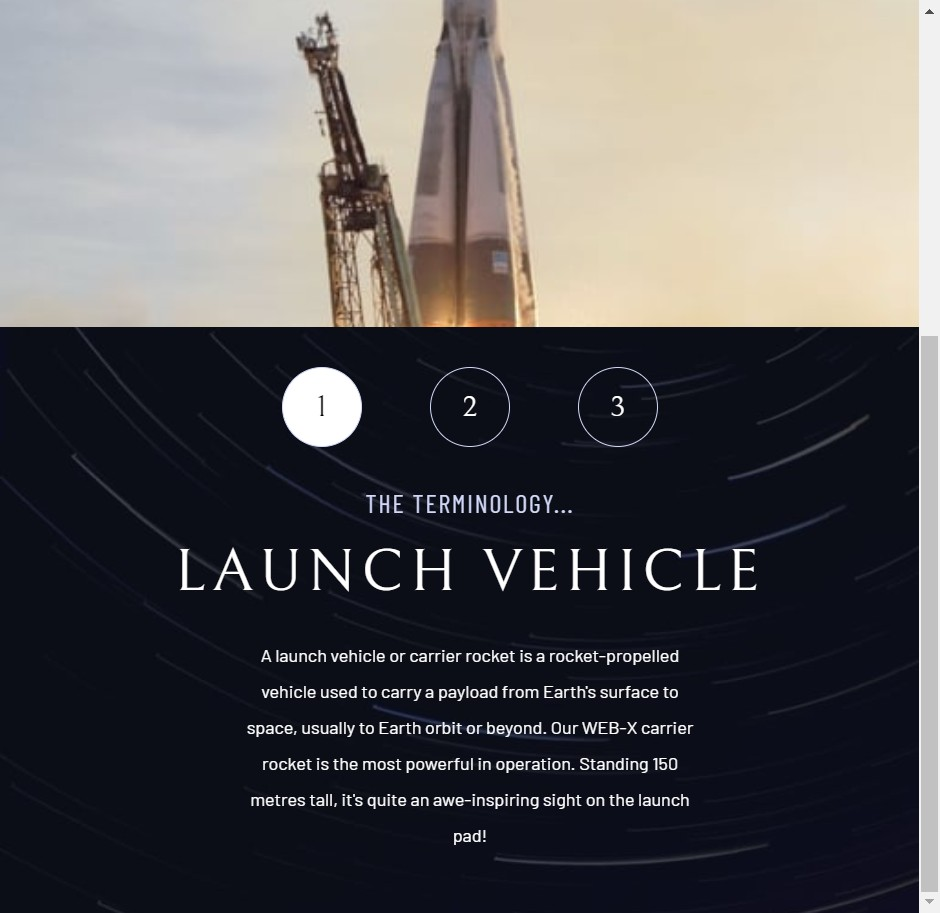</img>

- mobile

  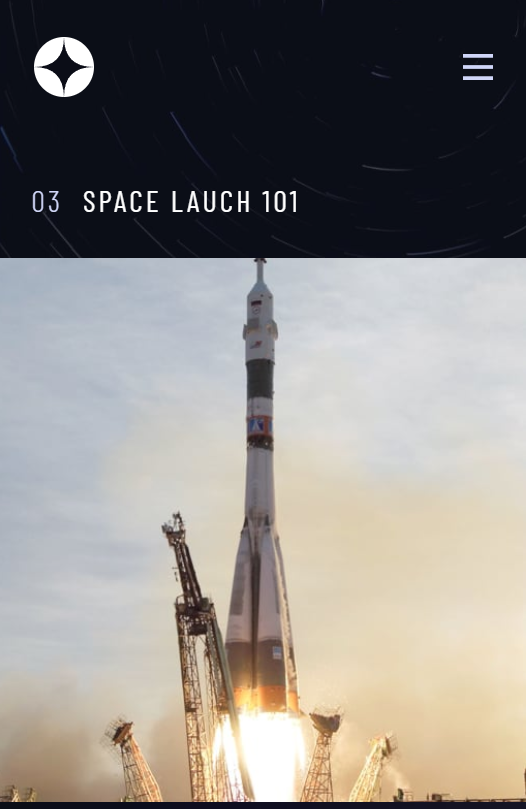</img> 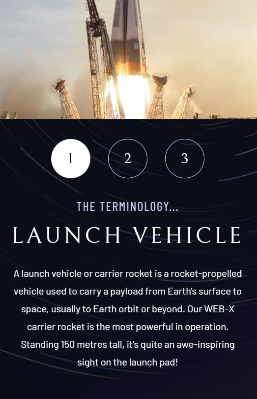</img> |

## My process

### Built with

- Vite + React
- Javascript
- Semantic HTML
- CSS custom properties
- Flexbox
- Desktop-first workflow

### folder structure

SRC:

- assets
  - crew
  - data
    - data.json
  - destination
  - home
  - shared
  - technology
- Components
  - Header
    - Header Desktop
      - index.jsx
      - HeaderDesktop.module.css
    - Header Mobile
      - index.jsx
      - HeaderMobile.module.css
- Pages
  - Home
    - index.jsx
    - style.css
  - Destination
    - index.jsx
    - style.css
  - Crew
    - index.jsx
    - style.css
  - Technology
    - index.jsx
    - style.css
- App.css
- App.jsx
- main.jsx

## Author

- GitHub - [This](#author)
- Frontend Mentor - [@AubChar101](https://www.frontendmentor.io/profile/AubChar101)

## Acknowledgments

- [Meee](#author)
